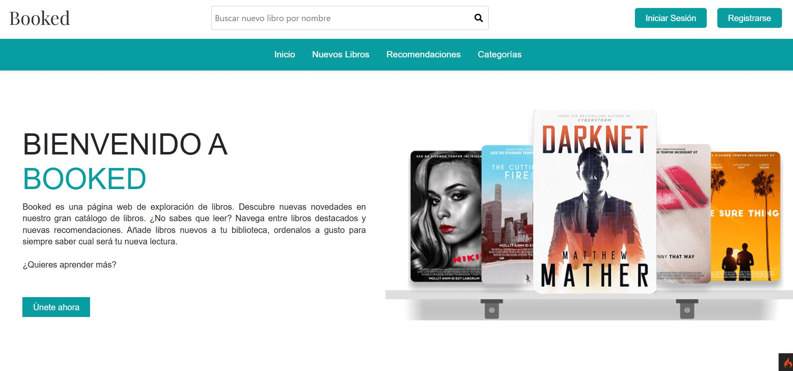
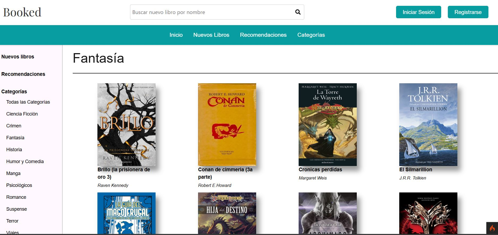
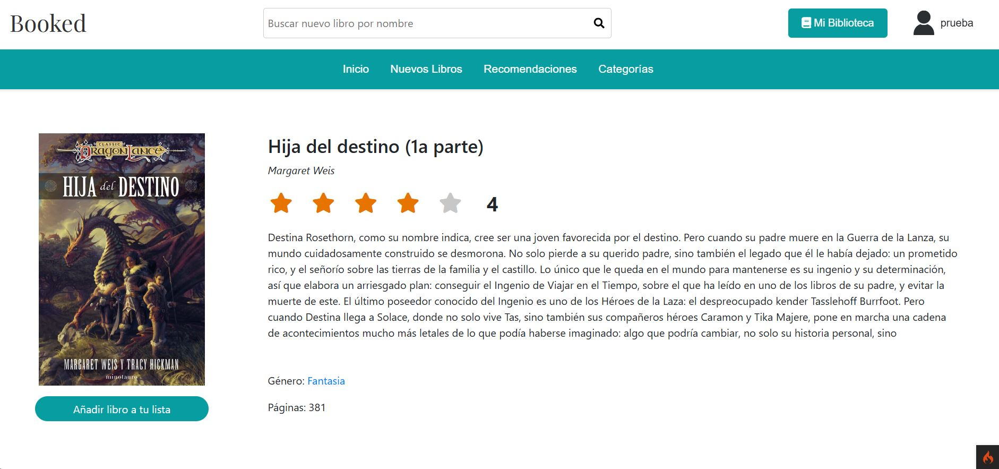
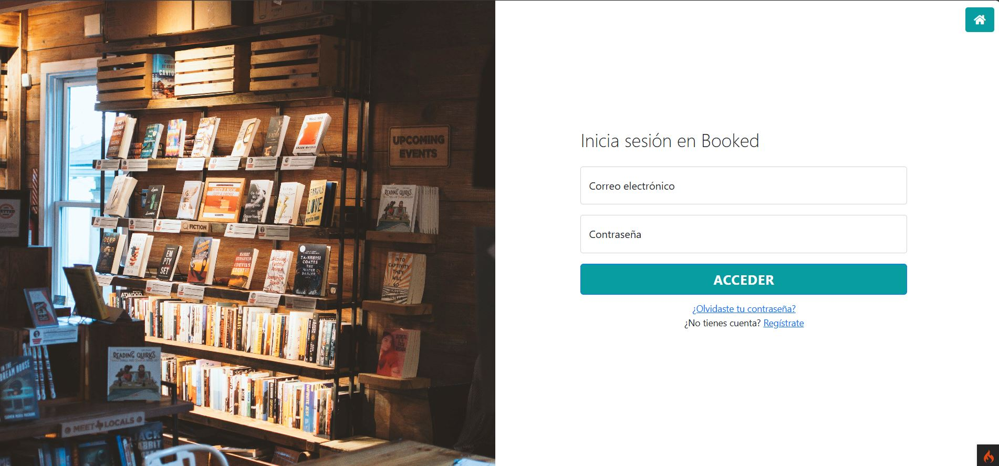
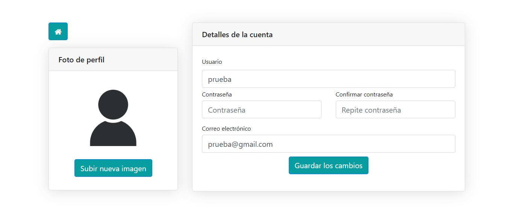
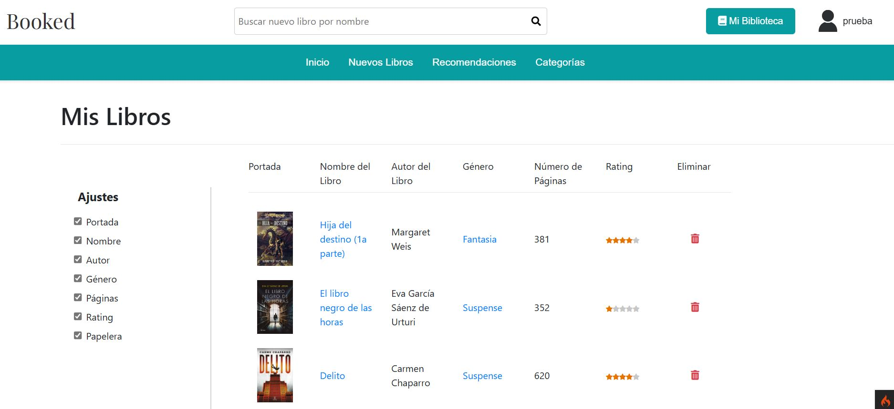

# Booked 📚

**Booked** is a web application built using PHP (CodeIgniter) and MySQL, running on XAMPP, that allows users to manage their favorite books efficiently.

## Features ✨

- 📂 **User Registration and Login**: Users can create an account and log in to manage their favorite books.
- 🖼️ **Profile Management**: Users can check and modify their profile information.
- 📚 **Manage Favorite Books**: Users can add books to their favorites list.
- ⭐ **Book Information**: Display books with detailed information such as rating, name, description and category.
- ✅ **Customizable Favorite List**: Users can show or hide specific columns (e.g., rating, description) using checkboxes to personalize the favorites book list view.

## Technologies Used 🛠️

- **XAMPP**: Local web server for hosting the application.
- **PHP (CodeIgniter)**: Backend framework for the application.
- **MySQL**: Database used to store user information and books.
- **AJAX**: Enables real-time updates to the UI without reloading the page. For example, when adding books to the favorites list.
- **HTML/CSS/JavaScript**: Frontend technologies for building the user interface.

## Application Screenshots 📸

Below are previews of the key functionalities of the application, showcasing the user interface design as well.

### Home Page
<p align="center">
    
</p>

### Books Catalog
<p align="center">
    
</p>

### Book Details
<p align="center">
    
</p>

### Sign Up
<p align="center">
    
</p>

### Log In
<p align="center">
    
</p>

### User Profile
<p align="center">
    
</p>

### Favorite Books
<p align="center">
    
</p>

## Installation Guide 🚀

To run **Booked** on your local machine, follow these steps:

### Prerequisites

- Download and install [XAMPP](https://www.apachefriends.org/index.html) (including Apache and MySQL).
- Basic knowledge of SQL and setting up a database.

### Steps to Install

1. **Clone the repository**:
   Open a terminal or command prompt and run:
   ```bash
   git clone https://github.com/iLuu02/Booked-Book-Management-Website.git
   cd booked

2. **Set up the Database**
   - Start Apache and MySQL
   - Open MySQL with http://localhost/phpmyadmin/
   - Create a new database with utf8mb4_general_ci codification and name it "booked". Ensure that the database's name is **"booked"**
   - Click the booked database and select the import tab
   - Navigate to the database folder inside the cloned repository and import booked.sql. Navigate to the bottom of the page and select import

3. **Set up XAMPP's Apache Server**
   - Navigate to XAMPP's installation folder and inside the htdocs folder place the cloned repository, rename it to "booked".
   - Then, inside XAMPP'S installation folder, navigate to /apache/conf/extra and open httpd-vhosts.conf
   - Write the following lines at the end of the file
   ```bash
   <VirtualHost *:80>
    DocumentRoot "C:/xampp/htdocs/booked/public"
    <Directory "C:/xampp/htdocs/booked/public">
        AllowOverride All
        Require all granted
    </Directory>
   </VirtualHost>
   ```
   - Save the file 
   - To conclude, navigate to /xampp/php and open php.ini
   - Find ;extension=intl line and remove the ";"
   - Save the file

4. **Try out the app**
   - Ensure to restart Apache and MySQL on XAMPP's Control Panel
   - Open localhost:80 on your desired web browser
   - Try out the app
